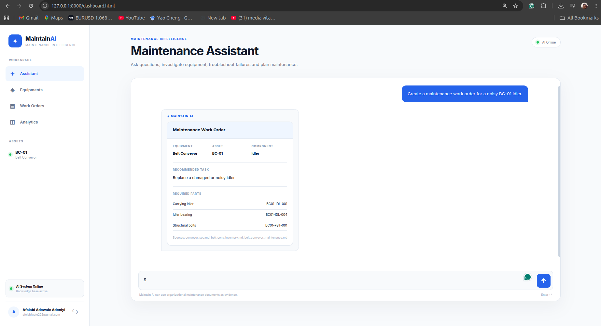

# MaintainAI

> AI-powered maintenance planning and engineering assistant for industrial maintenance teams.

MaintainAI helps maintenance engineers and planners turn scattered maintenance knowledge into actionable engineering decisions.

In industrial environments, critical maintenance information is often distributed across equipment manuals, maintenance procedures, technical reports, work instructions, and other operational documents. Finding the right information quickly can be difficult, especially when engineers need to make decisions while planning or troubleshooting maintenance work.

MaintainAI provides an AI interface for this knowledge.

It combines **Retrieval-Augmented Generation (RAG)** with general engineering intelligence to retrieve organization-specific maintenance information, analyze engineering questions, and generate structured recommendations for maintenance planning.

---

## The Problem

Maintenance teams work with large amounts of technical information:

- Equipment manuals
- Maintenance procedures
- Component specifications
- Historical maintenance documentation
- Work instructions
- Technical reports
- Inspection information
- Engineering documentation

This information is often difficult to search and use efficiently.

A maintenance engineer may need to answer questions such as:

- What maintenance procedure applies to this equipment?
- What component is associated with a particular part number?
- What should be checked before carrying out a maintenance task?
- What tools or parts are required?
- What does the organization's maintenance documentation say about a particular failure?
- How should a maintenance task be structured into a work order?

Traditional keyword search can find documents, but it does not understand the engineering context of the question.

General-purpose AI models can understand engineering concepts, but they may not have access to an organization's specific maintenance knowledge.

**MaintainAI bridges this gap.**

---

# What MaintainAI Does

MaintainAI is built around three core capabilities:

### 1. Retrieval

MaintainAI retrieves relevant information from an organization's maintenance documentation using a RAG pipeline.

Instead of relying entirely on the model's general knowledge, the system searches the organization's indexed maintenance documents and provides relevant context to the AI.

This allows engineers to ask questions about organization-specific equipment and procedures.

### 2. Analysis

The retrieved information is combined with an AI model to analyze the engineering question.

MaintainAI can distinguish between:

- Organization-specific maintenance questions
- General engineering questions

Organization-specific questions use the organization's maintenance knowledge base, while general engineering questions can be answered using the model's broader engineering knowledge.

### 3. Recommendation

MaintainAI converts the available information into structured maintenance recommendations.

For example, it can help produce:

- Maintenance task descriptions
- Work-order recommendations
- Required parts and components when documented
- Equipment information
- Maintenance considerations
- Relevant document sources

The goal is not to replace maintenance engineers.

The goal is to **reduce the time required to find information and prepare maintenance decisions.**

---

# Product Capabilities

## AI Maintenance Assistant

Engineers can interact with MaintainAI using natural language.

Example:

```text
What maintenance should be performed on BC-01 before replacing the belt?
````

MaintainAI retrieves relevant maintenance information and generates a structured response.

---

## Organization-Specific Knowledge Retrieval

MaintainAI uses Retrieval-Augmented Generation to ground responses in an organization's maintenance documentation.

The current retrieval pipeline uses:

* Document processing
* Text chunking
* Sentence Transformers
* Vector embeddings
* FAISS similarity search
* DeepSeek for response generation

This creates a searchable engineering knowledge layer over existing maintenance documents.

---

## Equipment Intelligence

MaintainAI can retrieve documented information about equipment and components.

For example:

```text
Equipment: BC-01
Asset Type: Belt Conveyor
Component: Drive Assembly
```

Where information is not available in the organization's documents, the system does not need to invent the missing information.

This is important for maintenance applications where unsupported specifications can lead to incorrect decisions.

---

## Work Order Planning

MaintainAI can transform engineering questions into structured maintenance work-order recommendations.

A recommendation can include:

* Maintenance task
* Equipment
* Required components or parts
* Maintenance considerations
* Relevant sources

This can reduce the amount of manual preparation required before maintenance work is scheduled.

---

## General Engineering Intelligence

Not every question requires organizational documents.

MaintainAI can also answer general engineering questions involving areas such as:

* Mechanical engineering
* Electrical engineering
* Maintenance engineering
* Equipment troubleshooting
* Engineering principles

This allows the platform to function as both a maintenance knowledge interface and a general engineering assistant.

---

## Conversation Memory

MaintainAI maintains conversation context so engineers can ask follow-up questions without repeating the entire problem.

Example:

```text
Engineer:
What should I inspect on BC-01?

MaintainAI:
The maintenance documentation recommends...

Engineer:
What components are involved?

MaintainAI:
The relevant components include...
```

---

## Authentication

The application includes user authentication using:

* JWT authentication
* Argon2 password hashing
* SQLite user database

This provides the foundation for eventually supporting organization-level access and user management.

---

# How It Works

```text
                         User
                           │
                           ▼
                  ┌─────────────────┐
                  │   FastAPI API   │
                  └────────┬────────┘
                           │
                           ▼
                 ┌──────────────────┐
                 │ Question Routing │
                 └────────┬─────────┘
                          │
             ┌────────────┴────────────┐
             │                         │
             ▼                         ▼
   Organization Maintenance     General Engineering
          Question                    Question
             │                         │
             ▼                         ▼
      ┌─────────────┐            ┌─────────────┐
      │ FAISS +     │            │  DeepSeek   │
      │ Embeddings  │            │             │
      └──────┬──────┘            └──────┬──────┘
             │                          │
             └────────────┬─────────────┘
                          ▼
                ┌──────────────────┐
                │ Structured AI    │
                │ Response         │
                └────────┬─────────┘
                         ▼
                  Engineer / Planner
```

---

# Architecture

MaintainAI follows a lightweight architecture designed to be deployable without requiring a large infrastructure stack.

```text
Frontend
HTML / CSS / JavaScript
        │
        ▼
FastAPI REST API
        │
        ├── Authentication
        │
        ├── Conversation Memory
        │
        └── AI Pipeline
                │
                ├── Question Routing
                │
                ├── RAG
                │    ├── Document Loader
                │    ├── Chunking
                │    ├── Embeddings
                │    └── FAISS
                │
                └── DeepSeek
```

---

# Current MVP

The current MaintainAI MVP demonstrates the complete workflow from engineering question to AI-generated maintenance response.

The demonstration environment uses a belt conveyor asset:

```text
Asset: BC-01
Asset Type: Belt Conveyor
```

The knowledge base contains organization-specific maintenance documentation that can be retrieved and used to ground AI responses.

The MVP currently demonstrates:

* User registration and authentication
* AI maintenance chat
* Organization-specific RAG
* General engineering questions
* Equipment information retrieval
* Structured work-order recommendations
* Conversation memory
* Source-aware responses
* Web-based dashboard

---

# Technology Stack

## Backend

* Python
* FastAPI
* SQLite
* Uvicorn

## AI / Machine Learning

* DeepSeek
* Sentence Transformers
* FAISS
* Retrieval-Augmented Generation (RAG)
* Vector similarity search

## Frontend

* HTML
* CSS
* Vanilla JavaScript

## Security

* JWT
* Argon2 password hashing

## Deployment

The application is designed to run as a lightweight web service and can be deployed using platforms such as Render.

---

# Project Structure

```text
maintain-ai/

├── api/
│   ├── main.py
│   ├── schemas.py
│   └── auth/
│
├── documents/
│   └── maintenance knowledge base
│
├── memory/
│   └── conversation memory
│
├── frontend/
│   ├── index.html
│   ├── login.html
│   ├── register.html
│   ├── dashboard.html
│   ├── style.css
│   ├── dashboard.css
│   └── app.js
│
├── data/
│   └── application data
│
├── app.py
├── rag.py
├── document_loader.py
├── requirements.txt
└── README.md
```

---

# Running Locally

## 1. Clone the repository

```bash
git clone <repository-url>
cd maintain-ai
```

## 2. Create a virtual environment

```bash
python -m venv maintenv
```

Activate it:

### Linux / macOS

```bash
source maintenv/bin/activate
```

### Windows

```bash
maintenv\Scripts\activate
```

## 3. Install dependencies

```bash
pip install -r requirements.txt
```

## 4. Configure environment variables

Create a `.env` file:

```env
HF_TOKEN=your_huggingface_token
```

## 5. Start the application

```bash
uvicorn api.main:app --reload
```

Open:

```text
http://127.0.0.1:8000
```

---

# Future Direction

The current MVP focuses on maintenance knowledge retrieval, analysis, and work-order planning.

The longer-term vision is to connect MaintainAI to existing industrial maintenance systems such as:

* CMMS
* Maintenance databases
* Asset management systems
* Work-order systems
* Equipment sensor data
* Historical maintenance records

This could enable more advanced maintenance intelligence, including:

### Maintenance Analytics

* Mean Time Between Failures (MTBF)
* Mean Time To Repair (MTTR)
* Maintenance costs
* Failure frequency
* Equipment downtime
* Recurring failures

### Equipment Intelligence

MaintainAI could combine maintenance history with equipment data to identify patterns across assets and components.

### Maintenance Decision Support

Historical work orders, failures, inspections, and maintenance activities could provide additional context for planning future maintenance work.

The objective is to evolve from an AI interface over maintenance documentation into a broader **maintenance intelligence layer for industrial operations.**

---

# Why MaintainAI

Industrial maintenance generates valuable engineering knowledge, but much of that knowledge remains locked inside documents, databases, and historical work orders.

MaintainAI explores how modern AI systems can make this knowledge easier for engineers and maintenance teams to access and use.

The platform focuses on three things:

```text
RETRIEVAL
Find the right maintenance knowledge.

        ↓

ANALYSIS
Understand the engineering context.

        ↓

RECOMMENDATION
Turn the information into actionable maintenance decisions.
```

---

# Project Status

**Current stage: MVP**

MaintainAI currently demonstrates a working AI maintenance assistant with:

* RAG-based maintenance knowledge retrieval
* General engineering intelligence
* Equipment information retrieval
* Work-order planning
* Conversation memory
* Authentication
* Web dashboard

The project is being developed as a foundation for integrating AI with real-world industrial maintenance workflows.

---

# Vision

> **Make industrial maintenance knowledge accessible at the moment engineers need it.**

MaintainAI aims to help maintenance teams spend less time searching through fragmented technical information and more time making informed maintenance decisions.

---

## MaintainAI

**Smarter Maintenance. Better Operations.**

