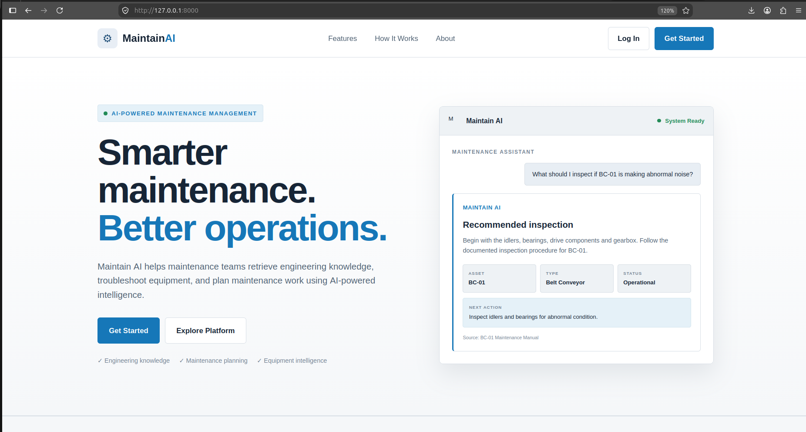

# Maintain AI



> AI-powered maintenance planning and engineering assistant for smarter maintenance operations.

Maintain AI is an AI-powered maintenance assistant designed to help engineers quickly access maintenance knowledge, troubleshoot equipment issues, and generate structured maintenance recommendations.

It combines **Retrieval-Augmented Generation (RAG)** with general engineering intelligence to distinguish between organization-specific maintenance knowledge and general engineering questions.

## ✨ Features

- 🤖 **AI Maintenance Assistant** — Ask questions about equipment, maintenance, and engineering.
- 🔎 **RAG Knowledge Retrieval** — Retrieves relevant information from organizational maintenance documents.
- 🔧 **Equipment Intelligence** — Provides equipment and component information such as item numbers and specifications when documented.
- 📋 **Work Order Planning** — Generates structured maintenance work-order recommendations.
- 🧠 **General Engineering Knowledge** — Answers general mechanical, electrical, and maintenance questions.
- 💬 **Conversation Memory** — Maintains context across conversations.
- 🔐 **Authentication** — Secure user registration and login using JWT and Argon2 password hashing.

## 🏗️ Architecture

```text
                    User
                      │
                      ▼
               FastAPI REST API
                      │
                      ▼
             Question Classifier
                ┌─────┴─────┐
                ▼           ▼
       Organization      General
       Maintenance      Engineering
                │           │
                ▼           ▼
            FAISS RAG    DeepSeek
                │           │
                └─────┬─────┘
                      ▼
               Structured Response
                      │
                      ▼
              HTML / CSS / JS
````

## 🛠️ Tech Stack

**Backend**

- Python
- FastAPI
- SQLite

**AI / ML**

- DeepSeek
- Sentence Transformers
- FAISS
- RAG

**Frontend**

- HTML
- CSS
- Vanilla JavaScript

**Security**

- JWT
- Argon2

## 📁 Project Structure

```text
maintain-ai/
├── api/                # FastAPI API and authentication
├── documents/          # Maintenance knowledge base
├── memory/             # Conversation memory
├── frontend/           # Web interface
├── data/               # FAISS index and application data
├── app.py              # AI/RAG pipeline
├── rag.py              # Retrieval system
├── document_loader.py  # Document processing
└── requirements.txt
```

## 🚀 Running Locally

```bash
git clone <repository-url>
cd maintain-ai

python -m venv maintenv
source maintenv/bin/activate

pip install -r requirements.txt

uvicorn api.main:app --reload
```

Then open:

```text
http://127.0.0.1:8000
```

## 🎯 Project Goal

Maintain AI demonstrates how **Generative AI, RAG, and traditional software engineering** can be combined to build practical AI systems for industrial maintenance.

The long-term vision is to integrate Maintain AI with organizational **CMMS, maintenance databases, and operational data** to enable deeper analytics such as MTBF, MTTR, failure trends, maintenance costs, and recurring equipment failures.

---

**Maintain AI
Smarter Maintenance. Better Operations.**
